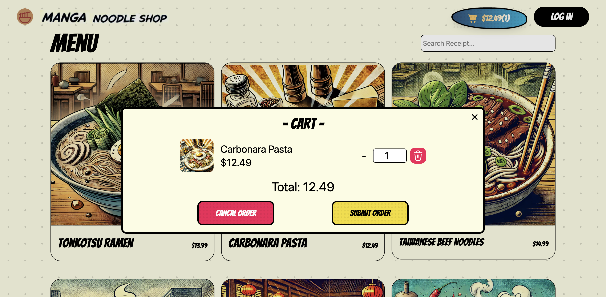
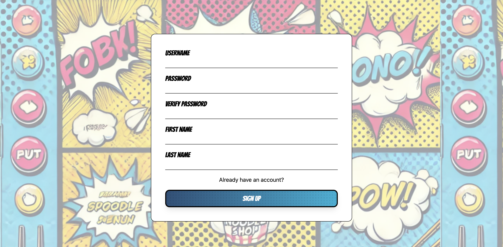

# 🍜 Manga Noodle Shop

Welcome to **Manga Noodle Shop** — a comic-style ramen ordering web app for hungry anime fans and full-stack developers alike! From spicy tonkotsu to expressive UI transitions, we've cooked up both flavor and functionality.

This is a full-stack web project featuring a separate frontend and backend architecture, utilizing GraphQL for flexible data querying.

## 🌐 Live Demo

- 🔗 [Frontend](https://manga-noodle-shop.vercel.app/)  
- 🔗 [GitHub Repository](https://github.com/PhilharmonicHsu/MangaNoodleShop)  

---

## 🧩 Tech Stack

### Frontend (React + Tailwind CSS)
- **React 18** – UI framework
- **Tailwind CSS** – Utility-first CSS styling
- **Comic-inspired UI** – Custom comic-style design for a fun, immersive experience
- Cart system using `localStorage` to store selected items

### Backend (Express.js + GraphQL)
- **GraphQL (Apollo Server)** – Flexible query language for fetching and mutating data
- **Express.js** – Server framework for routing and middleware
- **MongoDB + Mongoose** – Database for menu items and order management
- **Cookie-session** – Lightweight session and login handling

### DevOps (Kubernetes)
- **Docker**
- **Kubernetes**

---

## 🧠 Features

- 🔍 Browse ramen items with comic-themed illustrations
- 🛒 Add/remove items to a persistent cart
- 📝 Place order (coming soon)
- 🧾 Admin panel for order management (planned)
- 🧬 GraphQL API ready for third-party integrations or internal frontend use

---

## 📁 Project Structure

```
MangaNoodleShop/ 
               ├── backend/ # Express + GraphQL API 
               │ ├── routes/ 
               │ ├── graphql/ 
               │ └── models/ 
               ├── frontend/ # React + Tailwind UI 
               │ ├── components/ 
               │ ├── pages/ 
               │ └── styles/ 
               └── README.md
```

---

## 🚀 Getting Started

### 1. Clone the repository

```bash
git clone https://github.com/PhilharmonicHsu/MangaNoodleShop.git
cd MangaNoodleShop
```
### 2. Start the Backend
```bash
cd backend
npm install
cp .env.example .env
npm run dev
```

### 3. Start the Frontend
```bash
cd frontend
npm install
npm dev
```
> Node.js v18+ is recommended

---

## 📸 Preview
### Banner Part


### Menu Part


### Cart Part


### Login & Sign Up



---

## 📄 License
MIT License © 2025 [PhilharmonicHsu](https://github.com/PhilharmonicHsu)

## 📬 Contact
Have questions or want to contribute?
Feel free to open an issue or reach out via email:
📧 `xuyuwei19940909@gmail.com`

> “A bowl of ramen can feed your hunger — and your developer soul.”
> — The Manga Noodle Shop Dev Team